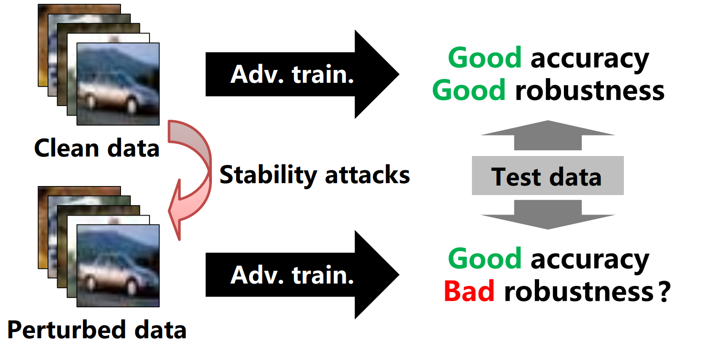
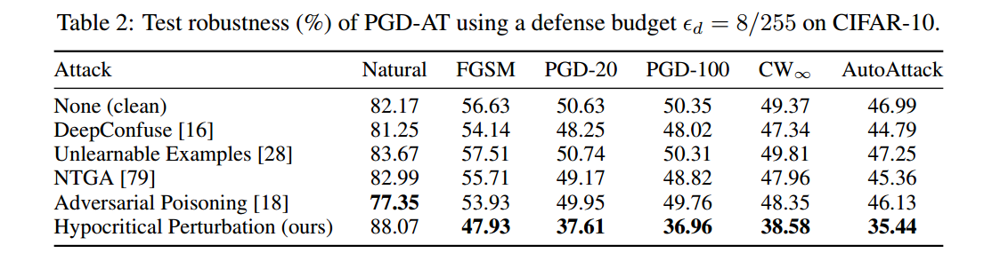
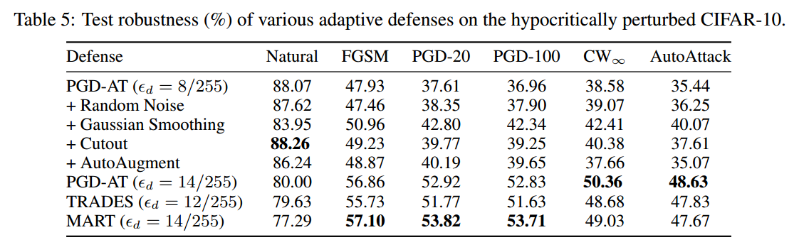

# Can Adversarial Training Be Manipulated By Non-Robust Features?

Code for NeurIPS 2022 paper "[Can Adversarial Training Be Manipulated By Non-Robust Features?](https://arxiv.org/abs/2201.13329)" by Lue Tao, Lei Feng, Hongxin Wei, Jinfeng Yi, Sheng-Jun Huang, and Songcan Chen. 
In the paper, we identify a novel threat model named stability attacks, which aims to hinder robust availability by slightly manipulating the training data.
This repository contains an implementation of hypocritical perturbations as stability attacks.

<p align="center"></p>

## Getting Started

Our code mainly relies on [PyTorch](https://pytorch.org/). Other required packages can be automatically installed by following the instructions below.
```
conda create -n hypocritical python=3.8
conda activate hypocritical
pip install -r requirements.txt
```

## Running Experiments

1- Training the crafting model on CIFAR-10.
```python
python main.py --train_loss AT --eps 2 --epochs 10
```

2- Crafting hypocritical perturbations.
```python
python poison.py --poison_type Hyp
```

3- Comprimising the conventional adversarial training scheme.
```python
python main.py --train_loss AT --eps 8 --poison_type Hyp
```

4- Enlarging the defense budget to resist stability attacks.
```python
python main.py --train_loss AT --eps 14 --poison_type Hyp
```

## Results

<p align="center"></p>

<p align="center"></p>

**Key takeaways:** 

- Hypocritical Perturbation is the most effective method in degrading the test robustness of adversarially trained models.
- Enlarging the defense budget for adversarial training methods including PGD-AT, TRADES, and MART is essential for mitigating hypocritical perturbations.

## Citing this work

```
@inproceedings{tao2022can,
    title={Can Adversarial Training Be Manipulated By Non-Robust Features?},
    author={Tao, Lue and Feng, Lei and Wei, Hongxin and Yi, Jinfeng and Huang, Sheng-Jun and Chen, Songcan},
    booktitle={Advances in Neural Information Processing Systems (NeurIPS)},
    year={2022}
}
```

